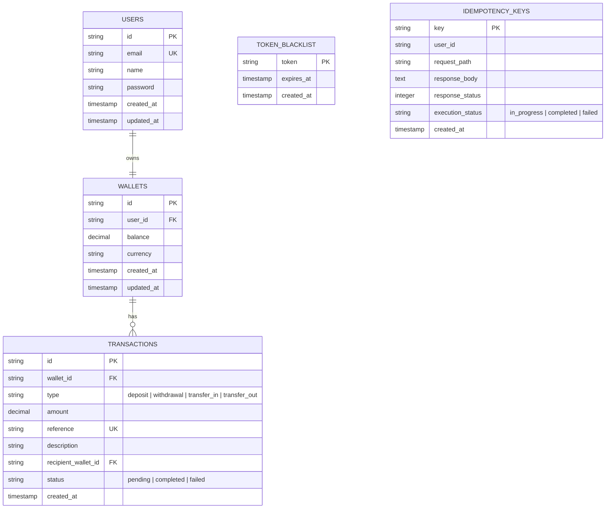

# Sage Grey Backend Assessment - Technical Design Document

## 1. System Overview

The Sage Grey Wallet Backend is a secure, ACID-compliant REST API built with Node.js, TypeScript, Express, KnexJS, and PostgreSQL. It enables user onboarding and robust financial wallet operations including account funding, peer-to-peer transfers, and withdrawals.

## 2. Architecture & Design Patterns

The application follows a clean, layered architectural pattern:

```text
[ Incoming Request ] -> [ Router & Validation ] -> [ Controller ] -> [ Service Layer ] -> [ Data Access Layer / Repo ] -> [ PostgreSQL DB ]
```

- **Presentation Layer (Controllers & Routes)**: Handles HTTP requests, response formatting, authentication checking, and strict schema validation via Zod.
- **Business Logic Layer (Services)**: Encapsulates all business rules, orchestration, and database transaction boundaries.
- **Data Access Layer (Repositories)**: Isolates direct database queries and ORM interactions using KnexJS.

## 3. Database Schema

The database relational model is normalized to maintain high data integrity.



## 4. Key Engineering & Security Decisions

### ACID Compliance & Race Condition Prevention

In financial applications, handling concurrent requests (e.g., double-spend attempts or simultaneous transfers) is paramount.

1. **Database Transactions (`knex.transaction`)**: Every deposit, withdrawal, or transfer is wrapped in a DB transaction ensuring that either all operations succeed or everything rolls back.
2. **Row-Level Locking (`SELECT ... FOR UPDATE`)**: When a withdrawal or transfer is initiated, the affected wallet rows are locked for update until the transaction completes. This prevents race conditions and ensures balance calculations are precisely synchronized.
3. **Deadlock Prevention**: When transferring funds between two wallets, the service sorts the wallet IDs and locks them in alphabetical order. This guarantees that two simultaneous reciprocal transfers (User A to B and User B to A) will never deadlock the database.

### Financial Idempotency (Double-Spend Immunity)

All financial mutation operations (`/fund`, `/withdraw`, `/transfer`) strictly enforce idempotency via the `X-Idempotency-Key` header.

When a client initiates a transaction, `IdempotencyGuard` checks the `idempotency_keys` table. If the key is new, it records status as `in_progress` and monkey-patches the Express response pipeline to intercept and cache the final JSON success payload. If network dropouts cause the client to retry the exact same request, the server intercepts the duplicate key and instantly returns the cached response with zero database execution, guaranteeing absolute protection against accidental double-spend!

### DDoS Protection & Rate Limiting

To safeguard the financial infrastructure against brute-force attacks and automated bots, strict rate limiters (`express-rate-limit`) are enforced:

- **Global Limiter**: Protects all general API routes with a 100 requests / 15-minute window per IP.
- **Auth Limiter**: Protects sensitive onboarding and login routes (`/register`, `/login`) with a strict limit of 20 attempts / 15 minutes per IP to prevent credential stuffing.

### Enterprise Token Blacklisting (Session Invalidation)

To provide absolute session revocation security, a dedicated `token_blacklist` table and repository intercept logged-out or revoked JWT tokens.

Whenever a user logs out (`POST /api/v1/auth/logout`), their Bearer token is immediately committed to the blacklist database alongside its natural JWT expiration timestamp. On every subsequent API request, `AuthGuard` queries the blacklist and instantly rejects invalidated tokens (`401 Unauthorized`), preventing token replay attacks.

### Twin-Record Audit Logging

When a transfer occurs, two distinct immutable transaction records are written:

- A `transfer_out` record attached to the sender's wallet.
- A `transfer_in` record attached to the recipient's wallet.

This guarantees a flawless audit trail for every user.

## 5. API Specification & Endpoints

### Authentication Endpoints

- `POST /api/v1/auth/register`: Register user and automatically create default NGN wallet.
- `POST /api/v1/auth/login`: Authenticate user and return Bearer token.
- `GET /api/v1/auth/profile`: Get current authenticated user details.
- `POST /api/v1/auth/logout`: Invalidate current Bearer token by adding it to the token blacklist.

### Wallet Endpoints (Supports `X-Idempotency-Key` Header)

- `GET /api/v1/wallet`: Retrieve wallet balance and transaction history.
- `POST /api/v1/wallet/fund`: Deposit funds. Body: `{ "amount": 5000 }`
- `POST /api/v1/wallet/withdraw`: Withdraw funds. Body: `{ "amount": 2000 }`
- `POST /api/v1/wallet/transfer`: Transfer funds. Body: `{ "recipient": "user@email.com", "amount": 1500 }`
